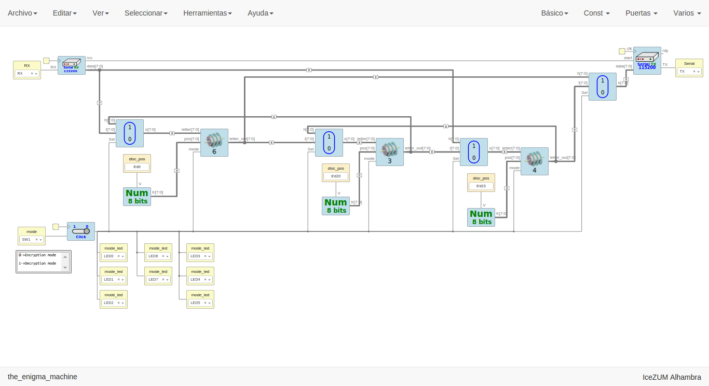

# The_enigma_project

## An open source FPGA Enigma Machine created with Icestudio and Verilog

The Enigma project is an Enigma Machine that encryps and decrypts messages through USB port using an Open source FPGA Icezum Alhambra.

Made it with Icestudio and Verilog code.

**A video explaining how works (Spanish)**

  

***

 The Enigma Machine-An open source FPGA Enigma Machine- by Julián Caro Linares licensed by <a rel="license" href="http://creativecommons.org/licenses/by-sa/4.0/">Creative Commons Attribution-ShareAlike 4.0 International License</a>.  
